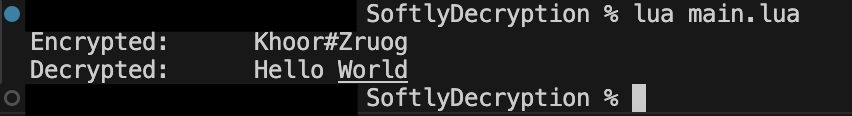

# Softly Decryption

[](LICENSE) 


A simple Lua project that demonstrates basic encryption and decryption using a Caesar cipher!



**Figure 1:** Encryption and decryption demo
---

## Project Structure
---
## Usage!

1. Make sure you have [Lua 5.4+](https://www.lua.org/) installed!
2. Clone or download this repository!
3. Run the Demo:
```bash
lua main.lua
```

Expected output!:
Encrypted: Khoor#Zruog
Decrypted: Hello World

## Distribution
You can share this project freely
If you improve or modify it, feel free to distribute your own version. But please give Credit
Works out-of-the-box with lua main.lua, no extra dependencies required.

## Open Source
This Project is open-source and intended for learning and experimentation
Contributions are welcome! If you'd like to add features (e.g., better ciphers, input handling, or tests), open a pull request

# Disclaimer
I'm 15 years old and still in high school
This project is mainly for learning Lua and encryption basics, so the code might not be the most optimized or secure. Please don't use this in production systems or do, I can't really stop you.

# License
This project is licensed under the MIT License.
You are free to:
- Use it in your own projects (personal or commercial)
- Modify the code
- Distribute copies
As long as you:
- Include attribution back to this repository
- Include the original license when distributing
FULL LICENSE TEXT CAN BE FOUND IN THE LICENSE FILE!
